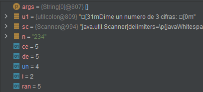

# EXAMEN UD3 ENTORNOS 
## EJERCICIO 1 - Importad el proyecto dado en INTELLIJ  EJERCICIO 2 - Cread un directorio "lib" dentro del proyecto  EJERCICIO 3 - Copiad el fichero utilcolor.jar dentro del directorio "lib"  EJERCICIO 4 - Incorpora el fichero JAR en el proyecto para poder usar la clase utilcolor.

El proyecto tiene una clase donde hay un main que es el que hay que depurar. Ejecuta el programa una vez sin puntos de ruptura para empezar a familiarizarte con él y pégale un vistazo general.

## EJERCICIO 5 - Poned un breakpoint al inicio del main y haced una tarza con la siguiente entrada: "Numero de 3 cifras: 234"
### Indicad qué valores tienen las siguientes variables durante la ejecución del bucle for (liínea 24)
| i | ran | ce | de | un |
|:-:|:---:|:--:|:--:|:--:|
| 0 | 3 | 2 | 3 | 3 |
| 1 | 8 | 8 | 3 | 8 |
| 2 | 5 | 5 | 5 | 4 |

## EJERCICIO 6 - Poned un breakpoint al inicio del segundo bucle for (linea 40), e indicad qué valen en ese punto las variables:
| ce | de | un | s1 |
|:--:|:--:|:--:|:--:|
| 2 | 3 | 4 | 9 |

## EJERCICIO 7 - ¿Qué significado tiene la variable "c" al respecto de s1 y del número inicial de 3 cifras?

La variable "c" al respecto de s1 indica cuantas veces se puede dividir (si es un número primo o no), respecto al número incial de 3 cifras indica el mínimo común múltiplo.

Ahora vamos a repetir el proceso con otra entrada de datos:

## EJERCICIO 8 - Poned un breakpoint al inicio del main y haced una tarza con la siguiente entrada: "Numero de 3 cifras: 562"
### Indicad qué valores tienen las siguientes variables durante la ejecución del bucle for (liínea 24)

| i | ran | ce | de | un |
|:-:|:---:|:--:|:--:|:--:|
| 0 | 8 | 5 | 8 | 8 |
| 1 | 3 | 3 | 6 | 3 |
| 2 | 6 | 6 | 6 | 2 |

## EJERCICIO 9 - Poned un breakpoint al inicio del segundo bucle for (linea 40), e indicad qué valen en ese punto las variables:

| ce | de | un | s1 |
|:--:|:--:|:--:|:--:|
| 5 | 6 | 2 | 13 |

## EJERCICIO 10 - Responde a las siguientes preguntas: 
- **¿En que afecta la librería utilcolor.jar importada al principio del programa?**
 Para modificar la fuente y color de los mensajes mostrados por pantalla.

- **¿Serías capaz de utilizar otros colores que no sean los establecidos en el lugar donde se usan en el main?**
 Sí, podríamos usar los colores "BLACK, RED, GREEN, YELLOW, BLUE, PURPLE, CYAN, WHITE"

- **¿Dónde puedes ver las opciones de colores que hay disponibles?**
 En las recomendaciones de INTELLIJ o entrando en el código de utilcolor

## EJERCICIO 11 - ¿Cuándo devuelve el programa "SI"?

Cuando la suma de las cifras introducidas es un número primo.

